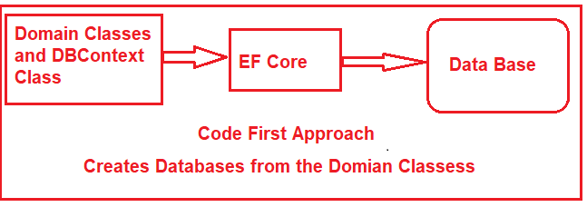

# **EF core** 

Entity Framework data access technology.

* **Cross-Platform:** EF Core works on various platforms, including Windows, macOS, and Linux.
* **Code-First Approach:** **In this approach, the data model (classes) is created first, and Entity Framework Core generates the database schema based on the model.
* **Database-First Approach:** **This approach is used when an existing database is available. Entity Framework Core can generate the data model (classes) based on the database schema.

ORM stands for Object-Relational Mapping, a programming technique that allows developers to convert data between incompatible systems, specifically between Object-Oriented Programming Languages (such as C#, Java, etc.) and Relational Databases (such as SQL Server, MySQL, Oracle, etc.).

ORM allows developers to work with data in terms of objects rather than tables and columns. That means ORM automatically creates classes based on database tables,

* **Simplifies Data Access:** ORMs abstract the complexities of data access, allowing developers to interact with the database in an object-oriented rather than writing complex SQL queries.
* **Increased Productivity:** Developers can build applications faster by focusing on the application logic rather than data access details	

## **EF Core Code First Approach:**

In the EF Core Code First Approach, first, we need to create our application domain classes, such as Student, Branch, Address, etc., and a special class (called DBContext Class) that derives from the Entity Framework Core DbContext class.

## **Package Installation**

The **EF Core DB Provider Package** is necessary because it allows EF Core to interact with the database. EF Core supports multiple databases, and you need to install the corresponding database provider for the database you want to use (e.g., SQL Server, SQLite, PostgreSQL, etc.).

Without the EF Core Database Provider package, **EF Core cannot perform database operations,** as it doesn’t know how to connect and communicate with the backend database.

SQL server - "**Install-Package Microsoft.EntityFrameworkCore.SqlServer**" - database provider

EF core tool package - "**Install-Package Microsoft.EntityFrameworkCore.Tools**"

## **DbContext Class**

The DbContext class is responsible for interacting with the database using the configured database provider

`DbContext` in EF Core acts as a bridge between the application and the database. It tracks entity states, manages queries, and handles data persistence and relationships efficiently.
